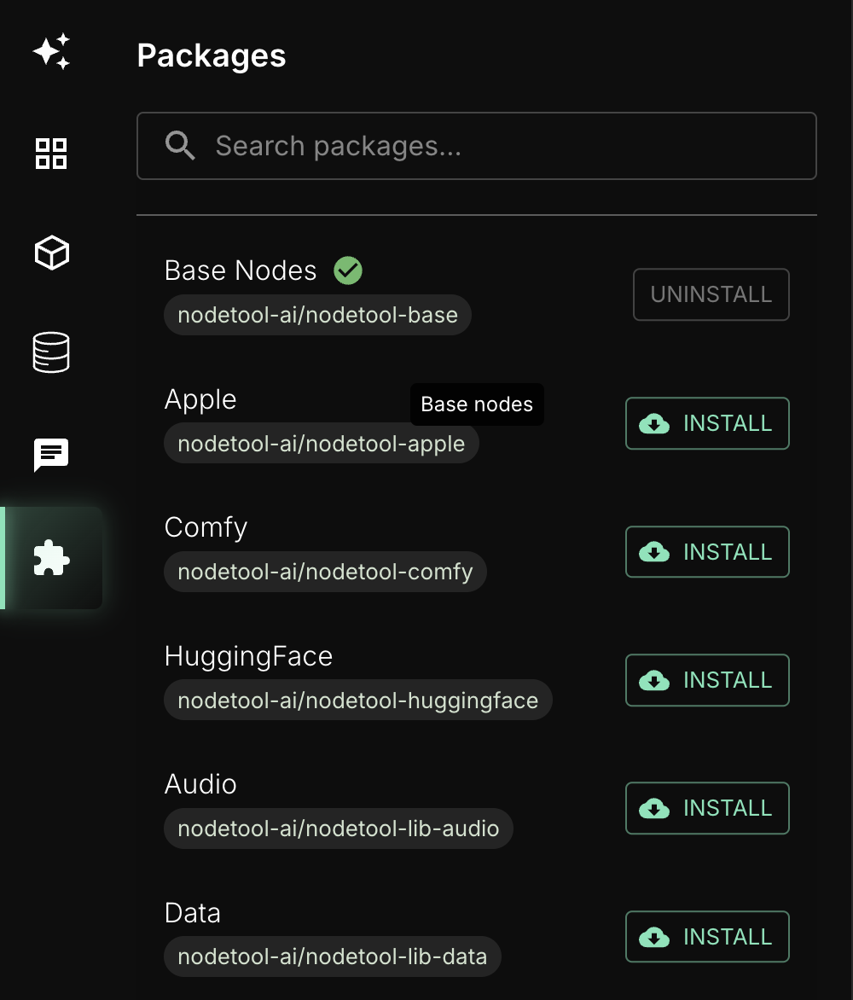

# Nodetool Package Management System

## Overview

The Nodetool Package Management System is designed to handle the installation, management, and distribution of node packages within the Nodetool ecosystem. Package installation is handled by pip, while the Nodetool UI and CLI tools provide interfaces for discovering and managing node packages.

## For Users

### Package Management in Nodetool UI

The primary interface for managing packages is through the Nodetool UI, which provides a user-friendly way to:

- Browse available node packages
- Install/uninstall packages (using pip under the hood)
- Update packages
- View package information and documentation



### CLI Usage (Advanced)

The CLI tool is available for advanced users who need direct access to package management operations. This can be useful for:

- Troubleshooting installation issues
- Manual package management
- System administration tasks

Basic commands:

```bash
# List installed packages
nodetool-package list

# List available packages in the registry
nodetool-package list --available

# Scan current directory for nodes and create metadata
nodetool-package scan

# Scan with verbose output
nodetool-package scan --verbose
```

## For Node Developers

### Creating a Node Package

To create a package that can be installed in Nodetool:

IMPORTANT: package name MUST start with `nodetool-`

1. Create a new Python package with the following structure:

```
your-package/
├── pyproject.toml
├── src/
│   └── your_package/
│       ├── __init__.py
│       └── nodes/
│           └── your_nodes.py
└── README.md
```

2. Configure your `pyproject.toml`:

```toml
[build-system]
requires = ["poetry-core>=1.0.0"]
build-backend = "poetry.core.masonry.api"

[tool.poetry]
name = "your-package"
version = "0.1.0"
description = "Short description about your package"
readme = "README.md"
authors = ["Your name <your@email.com>"]
packages = [{ include = "your_package", from = "src" }]
include = ["src/nodetool/package-metadata/your-package.json"]

[tool.poetry.dependencies]
python = "^3.10"
nodetool-core = { git = "https://github.com/nodetool-ai/nodetool-core.git", rev = "main" }
# add your package dependencies
```

3. Create your node classes:

```python
from pydantic import Field
from nodetool.workflows.base_node import BaseNode

class MyNode(BaseNode):
    """Example node implementation"""

    prompt: str = Field(
        default="Build me a website for my business.",
        description="Input prompt for the node"
    )

    async def process(self, context: ProcessingContext) -> str:
        # Your node implementation here
        return "Node output"
```

4. Generate node metadata:

   - Run `nodetool-package scan` in your package repository
   - This will create `your_package.json` file in `src/nodetool/package_metadata`

5. Publish your project to a Github repository

6. Register your package in the Nodetool registry:
   - Fork this repository
   - Add your package information to [index.json](index.json)
   - Submit a pull request

### Package Requirements

Your package should:

- Follow Python packaging best practices
- Include clear documentation for each node
- Provide example usage
- Include proper node metadata (generated via `nodetool-package scan`)

### Testing Your Package

Before submitting to the registry:

1. Install your package locally:

```bash
pip install -e .
```

2. Restart Nodetool UI

3. Verify your nodes appear in the Nodetool UI

## Package Registry

The Nodetool package registry is hosted at [nodetool-registry](https://github.com/nodetool-ai/nodetool-registry). The registry maintains:

- Package metadata in `index.json`
- Installation instructions
- Version information
- Node documentation

Each package in the registry includes:

- Name
- Description
- Repository ID (owner/project format)
- Namespaces provided
- Node metadata

## License

This package management system is part of the Nodetool project. See the main [project repository](https://github.com/nodetool-ai/nodetool) for license information.
